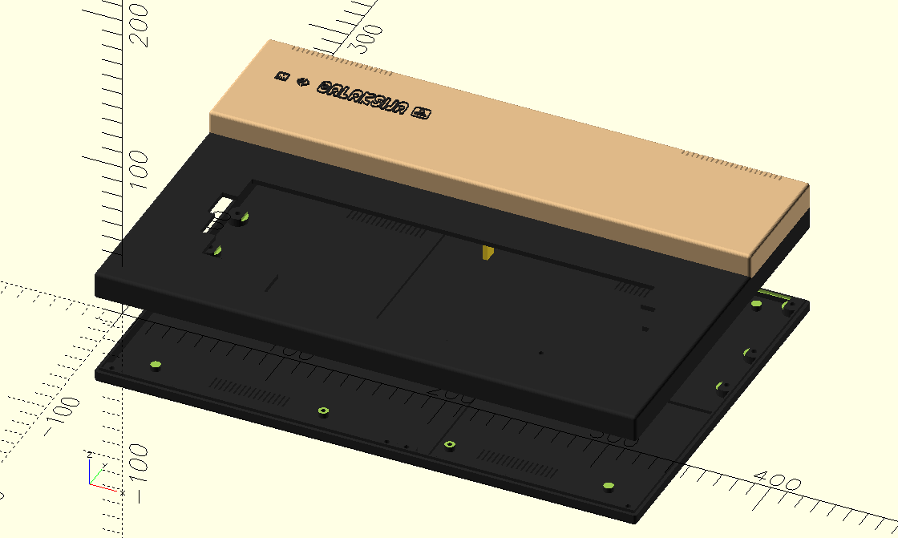

# galaksija
My recontrstrucion of Galaksija computer

- Case
  - It contains scad files for the enclosure and the keys.
  - The enclosure can be printed in 4 parts in order to fit in normal printers (aka Ender3)
  - Keys include also an stabilizer for space bar.
  
  
  
  
- HW (TO-DO)
  - In order to build it follow instructions from https://github.com/mejs/galaksija
  - I have used 27C512 for the ROMs in a Manhattan style.
  - Source authentic ICs or you will have problems and a lot of "fun".  
  
- SW (TO-DO)
  - To load SW I got best results with a laptop. Mobile phone seem to have lower signal voltage and did not work.
