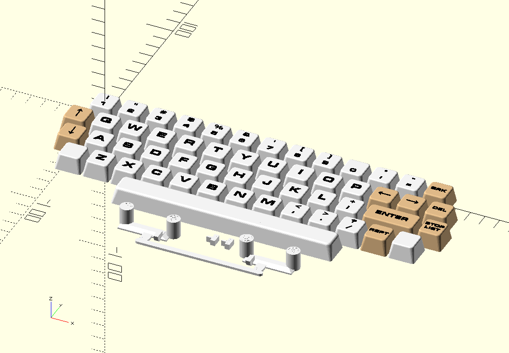

# galaksija
My building of Galaksija computer (thanks a lot Vlado Vince!)

- Case [(link)](https://github.com/issalig/galaksija/tree/main/case)
  - It contains scad files for the enclosure and the keys. [(base)](https://github.com/issalig/galaksija/blob/main/case/galaksija_case_base.stl) [(top)](https://github.com/issalig/galaksija/blob/main/case/galaksija_case_top.stl) [(keys)](https://github.com/issalig/galaksija/blob/main/case/galaksija_keys.stl)
  - The enclosure can be printed in 4 parts in order to fit in normal printers (aka Ender3)
  - Keys include also an stabilizer for space bar, you can print keys with letters on it or whithout it ans use stickers [(link)](https://github.com/issalig/galaksija/blob/main/case/galaksija_letters.pdf). Of course the script to generate it is available [(link)](https://github.com/issalig/galaksija/blob/main/case/galaksija_letters.py)
  
  
  
  
- HW  [(link)](https://github.com/issalig/galaksija/tree/main/hw)
  - In order to build it follow instructions from https://github.com/mejs/galaksija
  - I have used v2 pcb which supports cherry switches (https://cdn.hackaday.io/files/6059259228256/Galaksija%20Outputs.zip) and you can get switches (70 pcs) from here (https://aliexpress.com/item/1005006396423418.html)
  - I use a Z80 that supports 20Mhz (not needed of course) Z84C0020PEC
  - I have used 27C512 for the ROMs instead of 2732 in a Manhattan style.
    - You just need add some wires like in the diagram and replicate the rom file.
    
    
    - Plan b: Get an adapter such as https://www.ukvac.com/forum/threads/2708-2716-2732-adapter-to-27512-eeprom.67258/
  - Get authentic ICs or you will have problems and a lot of "fun".
  - I have wired BRK, NMI and Reset and connected to buttons on the back side.
    
  - Audio connections go to KI and KM
  - C2 is 1 uF (105)
  - Capacitor next to Z80 is 3.3 nF (332)

- ROMS [(link)](https://github.com/issalig/galaksija/tree/main/roms)
  - Assembly files for ROM A, B and C !!!!!
  - For my building I am using [(version 29 with B autostart)](roms/original/ROM_A_with_ROM_B_init_ver_29.bin)
    - You can check it from the computer with
      ```basic
      DUMP &0037,1
      1D (for version 29)
      DUMP &03F9,1
      CD 00 10 (for version 29)
      ```
  - For ROM B, I use normal [(ROM_B)](roms/original/ROM_B.bin)
    - Check your with
      ```basic
      DUMP &1024,1
      0C (for ROM B normal)
      ```
    
          
  
- SW (TO-DO)
  - Document GTP format (WIP)
  - To load SW I got best results with a laptop. Mobile phone seem to have lower signal voltage and did not work.
